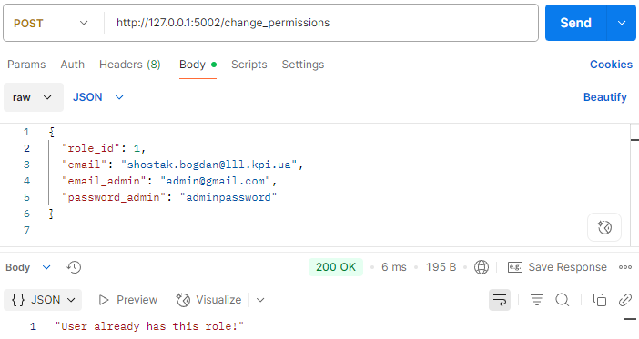

# Тестування працездатності системи

Тестування системи проводилося з використанням інструменту Postman, який дозволяє перевіряти API-запити та їх відповіді. Нижче наведено результати тестування основних функцій системи.

## Перегляд користувачів

### Успішний перегляд користувачів

Для тестування успішного отримання даних всіх користувачів було надіслано GET-запит на endpoint `/fetch_users`. У відповідь було отримано список всіх користувачів, зареєстрованих у системі.

## Реєстрація користувача

### Успішна реєстрація

Для тестування успішної реєстрації користувача було надіслано POST-запит на endpoint `/registration` з усіма необхідними параметрами: `login`, `first_name`, `last_name`, `password`, `email`, та `role_id`. У відповідь було отримано повідомлення про успішну реєстрацію.

### Неуспішна реєстрація

При спробі реєстрації користувача без обов'язкових параметрів, сервер повернув помилку з повідомленням про відсутність необхідних даних. Це підтверджує правильність обробки помилок на стороні сервера.

## Авторизація користувача

### Успішна авторизація

Для тестування успішної авторизації було надіслано POST-запит на endpoint `/login` з параметрами `email` та `password`. Сервер успішно авторизував користувача та повернув повідомлення про успішний вхід.

### Неуспішна авторизація через невірний email

При спробі авторизації з електронною поштою, яка не зареєстрована в системі, сервер повертає повідомлення "User not found!". Це підтверджує правильність перевірки наявності користувача в базі даних.

### Неуспішна авторизація через невірний пароль

При спробі авторизації з невірним паролем, сервер повернув помилку з повідомленням про невірний пароль. Це підтверджує правильність перевірки даних користувача.

## Зміна ролі користувача

### Успішна зміна ролі

Для тестування успішної зміни ролі користувача було надіслано POST-запит на endpoint `/change_permissions` з параметрами `email`, `email_admin`, `password_admin`, та `role_id`. Сервер успішно змінив роль користувача та повернув повідомлення про успішну зміну.

### Неуспішна зміна ролі через відсутність прав

При спробі зміни ролі користувача без необхідних прав адміністратора, сервер повернув помилку з повідомленням про відсутність прав. Це підтверджує правильність перевірки прав доступу.

### Неуспішна зміна ролі через наявність цієї ролі у користувача

При спробі змінити роль користувача на ту, яку він вже має, сервер повертає повідомлення "User already has this role!". Це означає, що користувач вже має призначену роль, і зміна не потрібна.

### Неуспішна зміна ролі через невірні дані адміністратора

При спробі зміни ролі з невірними даними адміністратора, сервер повернув помилку з повідомленням про невірні дані. Це підтверджує правильність перевірки даних адміністратора.

### Неуспішна зміна ролі через невірний email користувача

При спробі змінити роль користувача з електронною поштою, яка не зареєстрована в системі, сервер повертає повідомлення "User not found!". Це підтверджує правильність перевірки наявності користувача в базі даних перед спробою змінити його роль.

## Видалення користувача

### Успішне видалення користувача

Для тестування успішного видалення користувача було надіслано POST-запит на endpoint `/delete_user` з параметром `email`. Сервер успішно видалив користувача та повернув повідомлення про успішне видалення.

### Неуспішне видалення користувача через відсутність в базі даних

При спробі видалення користувача, якого не існує в базі даних, сервер повертає повідомлення про помилку з повідомленням "User not found!". Це підтверджує правильність обробки помилок на стороні сервера, коли користувача не існує в системі.

